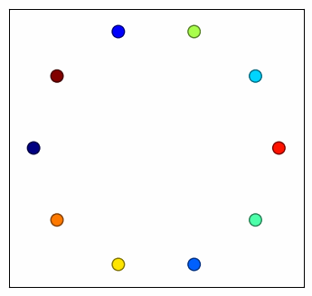

# Convex-Concave Slides and Code

This repository contains the [EE 364a](https://web.stanford.edu/class/ee364a/) slides on the convex-concave procedure,
together with example code.

For more theoretical background, please refer to Thomas Lipp's and Stephen Boyd's paper
on [Variations and Extensions of the Convex-Concave Procedure](https://web.stanford.edu/~boyd/papers/cvx_ccv.html).

Most of the examples use [DCCP](https://web.stanford.edu/~boyd/papers/dccp.html),
which is short for disciplined convex-concave programming. DCCP is based on the domain-specific language
for convex optimization [CVXPY](https://www.cvxpy.org).

Here is an example on collision avoidance, using the convex-concave procedure. Each colored vehicle aims
to travel to the opposite side of the circle of initial positions.
We minimize the total distance travelled by all vehicles, subject to
no collisions.

